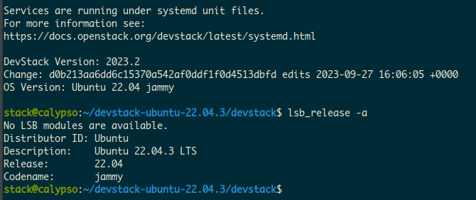

# devstack-ubuntu-22.04.3
Devstack source snapshot that works on a fresh install of Ubuntu 22.04.3




## Installation

Create a `stack` user with sudo privileges and clone the repo.

```bash
 $ sudo useradd -s /bin/bash -d /opt/stack -m stack
 $ sudo chmod +x /opt/stack
 $ sudo usermod -aG sudo stack
 $ sudo su - stack
 $ pwd #you should now be on /opt/stack  
 $ git clone https://github.com/heralli/devstack-ubuntu-22.04.3.git
 $ cd devstack-ubuntu-22.04.3/devstack
 $ cp samples/local.conf .
```

Set/Change the following in `local.conf`

```bash
HOST_IP=<changeme>
ADMIN_PASSWORD=<changeme>
```

Run `stack.sh`

```bash
 $ ./stack.sh
```
